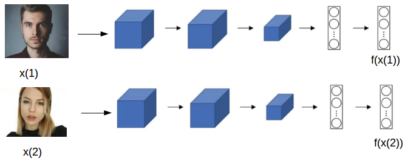

<h1>Objective</h1> 
This is a simple face recognition webapp using flask web framework. In this I have used one shot learning algorithm. It uses siamese network to compare the person faces and predicts wheather they are same or not.

<h1>Description</h1>
One-shot learning is an object categorization problem, found mostly in computer vision. Whereas most machine learning based object categorization algorithms require training on hundreds or thousands of samples/images and very large datasets, one-shot learning aims to learn information about object categories from one, or only a few, training samples/images.

In this project , I have used two deep learning models namely res10_300x300_ssd_iter_140000.caffemodel which is used to extract a face from the frame and then it is passed on to the pretrained VGG_face model which is used to generate facial embeddings from it. These facial embeddings then comapred and predicts wheather they are same persons or not by using cosine similarity.
It is built using flask framework and deep learning techniques.
<h1>Results</h1>

